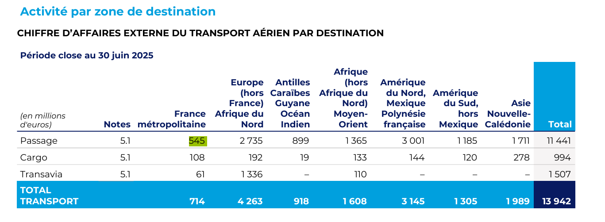
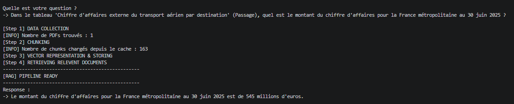
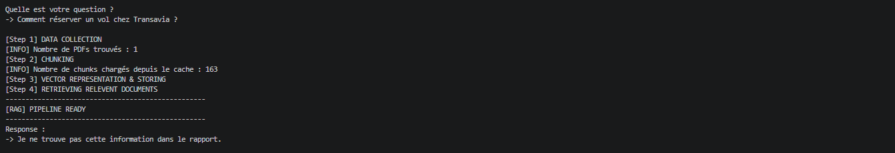

# 📊 Financial RAG Pipeline

This project is a Retrieval-Augmented Generation (RAG) system built to extract precise financial data from complex PDF reports. It ensures high accuracy and prevents the AI from guessing or making up numbers.


## 🚀 Key Features
- **Strict Extraction:** Forces the AI to extract exact figures from tables without attempting to calculate or interpret the math.
- **Hallucination Prevention:** If the requested data is not present in the document, the system safely replies that the information cannot be found.
- **Modular Design:** Clear separation between document reading, text chunking, data vectorization, and answer generation.

## 📸 See it in Action

Here is how the system handles complex financial data extraction:

### 1. The Source Data (Complex PDF Table)
*Extracting specific regional revenue from a dense corporate report.*


### 2. Successful Extraction
*The system successfully retrieves the exact number without confusion.*


### 3. The "Not Found" Safety Net
*When asked a question not covered by the document, the system refuses to guess.*
 

## 📁 Project Structure

The repository is structured to separate raw data from business logic:

```text
LLM-RAG/
├── assets/               # Images and diagrams for documentation
├── data/
│   ├── chunks/           # Serialized cache files
│   ├── markdown/         # Raw formatted text after PDF extraction
│   └── pdf/              # Original source documents
├── notebooks/
│   └── notebook.ipynb    # Interactive testing and experiments
├── src/
│   ├── app/
│   │   └── main.py             # Main entry point (RAG Orchestrator)
│   ├── generation/
│   │   └── generator.py        # LLM and prompt configuration
│   ├── processing/
│   │   ├── chunking.py         # Splitting logic
│   │   ├── embedder.py         # Embeddings model initialization
│   │   └── load_documents.py   # PDF ingestion and parsing
│   └── retrieval/
│       └── vector_store.py     # FAISS index creation and querying
├── .env                  # API Keys
├── .gitignore            # Git ignored files
└── README.md


## ⚙️ Installation

1. Clone the repository
2. Install dependencies
   pip install -r requirements.txt
3. Create a `.env` file with your API keys
   GROQ_API_KEY=your_key
   HUGGINGFACEHUB_API_TOKEN=your_key
   LLAMA_CLOUD_API_KEY=your_key

## 🛠️ Usage

Run from the project root:
   python src/app/main.py